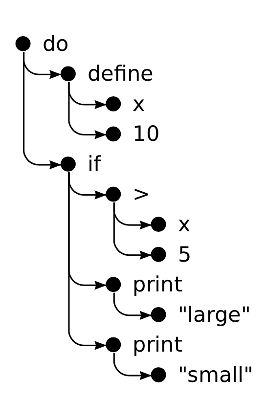

# Chap 12. Project: A Programming Language
* Egg

## Parsing
* Parser: syntax에 따라 text를 읽어 들여, data structure를 만들어 내는 프로그램
* Egg
  - expression으로 만 구성
  ```js
  do(define(x, 10),
    if(>(x, 5),
      print("large"),
      print("small")))
  ```
  - `>(x, 5)` syntax tree
  ```json
  {
    type: "apply",
    operator: {type: "word", name: ">"},
    args: [
      {type: "word", name: "x"},
      {type: "value", value: 5}
    ]
  }
  ```

* code

## The Evaluator
* code

## Special Forms
* code

## The Environment
* code

## Functions
* code

## Compilation
* program의 parsing과 running 사이에 추가하는 효과적으로 처리하도록 변환하는 과정
  - 변수를 binding name으로 반복해서 찾지 않고, 메모리에서 바로 가져오도록 하는 등
* Egg에서 가능한 것
  - Javascript program으로 변환하여, function에서 javascript compiler가 사용되도록 하여 실행 향상

## Cheating
* Egg의 `if, while` 구현은 Javascript의 if, while을 이용하여 구현
* 실제 프로그래밍 언어를 만드는 것과 다르지만 프로그래밍 언어의 이해에 도움
* domain-specific languate
  - 특정 도메인을 표현하기 위해 만들어진 언어
