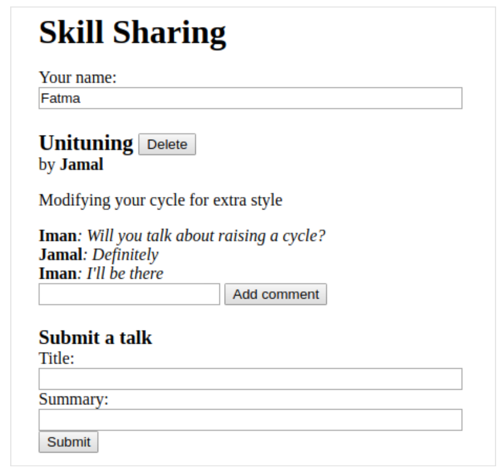

# Chap 21. Project: Skill-Sharing Website
* skill-sharing meeting website

## Design
* server
  - Node.js
  - 다음 미팅에 대한 제안 목록 제공
  - talk
    - 발표자
    - 제목
    - 요약
    - comments
  - live view



## Long Polling
* 변경이 있을 경우 client에 즉시 notify하기 위해 client에 connection이 필요함
  - client가 connection을 open하고 유지하도록 하여 필요 시 정보를 보냄
* WebSockets
  - modern browser에서 데이터 교환을 위해 connection을 open할 수 있도록 지원
* long polling
  - client가 새로운 정보를 server에 요청, server는 새로운 정보가 없을 때 까지 응답을 지연함
  - client는 계속적으로 server에 request open을 polling
  - connnection의 time out을 방지하기 위해 각 요청마다 maximum time을 설정함
  - server에서는 open 된 TCP connection 수가 증가되나, Node에서는 connection 별로 thread를 만들지 않아 이 경우에 적절함

## HTTP Interface
* `/talks`
  - request/response body는 JSON을 사용
  - `GET /talks`
  ```json
  [{"title": "Unituning",
  "presenter": "Jamal",
  "summary": "Modifying your cycle for extra style",
  "comments": []}]
  ```
  - `PUT /talks/:title` (Add new talk)
  ```json
  PUT /talks/How%20to%20Idle HTTP/1.1
  Content-Type: application/json
  Content-Length: 92

  {"presenter": "Maureen",
  "summary": "Standing still on a unicycle"}
  ```
  - `DELETE /talks/:title` (Delete talk)
  - `POST /talks/:title/comments` (Add comment)
  ```json
  POST /talks/Unituning/comments HTTP/1.1
  Content-Type: application/json
  Content-Length: 72

  {"author": "Iman",
  "message": "Will you talk about raising a cycle?"}
  ```
  - long polling 지원 (`GET /talks`)
    - extra headers 정보를 추가하여 호출
    - `Etag` 변경이 없는 경우 응답을 지연시키기 위해 header 추가 `Prefer: wait=90`: 90초 동안 응답 지연
    ```
    GET /talks HTTP/1.1
    If-None-Match: "4"
    Prefer: wait=90

     (time passes)

    HTTP/1.1 200 OK
    Content-Type: application/json
    ETag: "5"
    Content-Length: 295
    ```
* `ETag` and `If-None-Match`
  - cache를 manage하기 위해 사용하는 header
  - `Etag`: server가 보내주는 resource의 current version
  - `If-None-Match`: client가 `Etag`가 있는 resource를 다시 보낼 경우 포함, 변경 없을 경우 server는 304 not modified 리턴

## The Server
### Routing
* `router`
  - request를 dispatch하여 처리할 hander function으로 전달
  - Router class, `router.js`
  ```js
  const {parse} = require("url");

  module.exports = class Router {
    constructor() {
      this.routes = [];
    }
    add(method, url, handler) {
      this.routes.push({method, url, handler});
    }
    resolve(context, request) {
      let path = parse(request.url).pathname;

      for (let {method, url, handler} of this.routes) {
        let match = url.exec(path);
        if (!match || request.method != method) continue;
        let urlParts = match.slice(1).map(decodeURIComponent);
        return handler(context, ...urlParts, request);
      }
      return null;
    }
  };
  ```

### Serving Files
* router에 해당하는 url이 아닐 경우 `public`에 있는 file을 serving 함
  - `ecstatic`을 사용
```js
const {createServer} = require("http");
const Router = require("./router");
const ecstatic = require("ecstatic");

const router = new Router();
const defaultHeader = {"Content-Type": "text/plain"};

class SkillShareServer {
  constructor(talks) {
    this.talks = talks;
    this.version = 0;
    this.waiting = [];

    let fileServer = ecstatic({root: "./public"});
    this.server = createServer((request, response) => {
      let resolved = router.resolve(this, request);
      if (resolved) {
        resolved.catch(error => {
          if (error.status != null) return error;
            return {body: String(error), status: 500};
        }).then(
          ({body,
            status = 200,
            headers = defaultHeaders}) => {
              response.writeHead(status, headers);
              response.end(body);
        });
      } else {
        fileServer(request, response);
      }
    });
  }
  start(port) {
    this.server.listen(port);
  }
  stop() {
    this.server.close();
  }
}
```

### Talks as Resources
* `talks/[title]`
```js
const talkPath = /^\/talks\/([^\/]+)$/;

router.add("GET", talkPath, async (server, title) => {
  if (title in server.talks) {
    return {body: JSON.stringify(server.talks[title]),
            headers: {"Content-Type": "application/json"}};
  } else {
    return {status: 404, body: `No talk '${title}' found`};
  }
});

router.add("DELETE", talkPath, async (server, title) => {
  if (title in server.talks) {
    delete server.talks[title];
    server.updated();
  }
  return {status: 204};
});

// retrieve the content of a request body
function readStream(stream) {
  return new Promise((resolve, reject) => {
    let data = "";
    stream.on("error", reject);
    stream.on("data", chunk => data += chunk.toString());
    stream.on("end", () => resolve(data));
  });
}

router.add("PUT", talkPath, async (server, title, request) => {
  let requestBody = await readStream(request);
  let talk;
  try { talk = JSON.parse(requestBody); }
  catch (_) {return {status: 400, body: "Invalid JSON"}; }
  if (!talk ||
      typeof talk.presenter != "string" ||
      typeof talk.summary != "string") {
    return {status: 400, body: "Bad talk data"};
  }
  server.talks[title] = {title,
                         presenter: talk.presenter,
                         summary: talk.summary,
                         comments: []};
  server.updated();
  return {status: 204};
});

router.add("POST", /^\/talks\/([^\/]+)\/comments$/,
  async (server, title, request) => {
    let requestBody = await readStream(request);
    let comment;
    try { comment = JSON.parse(requestBody); }
    catch (_) { return {status: 400, body: "Invalid JSON"}; }

    if (!comment ||
          typeof comment.author != "string" ||
          typeof comment.message != "string") {
      return {status: 400, body: "Bad comment data"};
    } else if (title in server.talks) {
      server.talks[title].comments.push(comment);
      server.updated();
      return {status: 204};
    } else {
      return {status: 404, body: `No talk '${title}' found`};
    }
});
```

### Long Polling Support
* `/talks`
  - regular request
  - long polling request
* talks array helper method
```js
SkillShareServer.prototype.talkResponse = function() {
  let talks = [];
  for (let title of Object.keys(this.talks)) {
    talks.push(this.talks[title]);
  }
  return {
    body: JSON.stringify(talks),
    headers: {"Content-Type": "application/json",
              "ETag": `"${this.version}"`}
  };
};
```
* handler
```js
router.add("GET", /^\talks$/, async (server, request) => {
  let tag = /"(.*)"/.exec(request.header["if-none-match"]);
  let wait = /\bwait=(\d+)/.exec(request.headers["prefer"]);
  if (!tag || tag[1] != server.version) {
    return server.talkResponse();
  } else if (!wait) {
    return {status: 304};
  } else {
    return server.waitForChanges(Number(wait[1]));
  }
});
```
* waitForChanges method
```js
SkillShareServer.prototype.waitForChanges = function(time) {
  return new Promise(resolve => {
    this.waiting.push(resolve);
    setTimeout(() => {
      if (!this.waiting.includes(resolve)) return;
      this.waiting = this.waiting.filter(r => r != resolve);
      resolve({status: 304});
    }, time * 1000);
  });
}
```
* updated
```js
SkillShareServer.prototype.updated = function() {
  this.version++;
  let response = this.talkResponse();
  this.waiting.forEach(resolve => resolve(response));
  this.waiting = [];
};
```
* create skill server instance
```js
new SkillShareServer(Object.create(null)).start(8000);
```

## The Client
### HTML
* index.html
  - file server ecstatic
  - ./public/index.html
```html
<!doctype html>
<meta charset="utf-8">
<title>Skill Sharing</title>
<link rel="stylesheet" href="skillsharing.css">

<h1>Skill Sharing</h1>

<script src="skillsharing_client.js"></script>
```

### Actions
* handleAction
  - state는 `{talks, user}` object에 저장
  - user가 하고자 하는 것을 action으로 표현
  - update state
```js
function handleAction(state, action) {
  if (action.type == "setUser") {
    localStorage.setItem("userName", action.user);
    return Object.assign({}, state, {user: action.user});
  } else if (action.type == "setTalks") {
    return Object.assign({}, state, {talks: action.talks});
  } else if (action.type == "newTalk") {
    fetchOK(talkURL(action.title), {
      method: "PUT",
      headers: {"Content-Type": "application/json"},
      body: JSON.stringify({
        presenter: state.user,
        summary: action.summary
      })
    }).catch(reportError);
  } else if (action.type == "deleteTalk") {
    fetchOK(talkURL(action.talk), {method: "DELETE"})
      .catch(reportError);
  } else if (action.type == "newComment") {
    fetchOK(talkURL(action.talk) + "/comments", {
      method: "POST",
      headers: {"Content-Type": "application/json"},
      body: JSON.stringify({
        author: state.user,
        message: action.message
      })
    }).catch(reportError);
  }
  return state;
}
```
* fetchOK
  - `fetch()`는 network 에러 등 fetch 자체 실행 시 오류가 발생할 때만 error가 발생하므로 response code에 따라 에러를 발생하도록 함
```js
function fetchOK(url, options) {
  return fetch(url, options).then(response => {
    if (response.status < 400) return response;
    else throw new Error(response.statusText);
  });
}
```
* talkURL
```js
function talkURL(title) {
  return "talks/" + encodeURIComponent(title);
}
```
* reportError
```js
function reportError(error) {
  alert(String(error));
}
```

### Rendering Components
* renderUserField
  - `elt` function: construct DOM elements
  ```js
  function elt(type, props, ...children) {
    let dom = document.createElement(type);
    if (props) Object.assign(dom, props);
    for (let child of children) {
      if (typeof child != "string") dom.appendChild(child);
      else dom.appendChild(document.createTextNode(child));
    }
    return dom;
  }
  ```
```js
function renderUserField(name, dispatch) {
  return elt("label", {}, "Your name: ", elt("input", {
    type: "text",
    value: name,
    onchange(event) {
      dispatch({type: "setUser", user: event.target.value});
    }
  }));
}
```
* renderTalk
  - 복잡한 DOM을 생성할 때는 elt를 이용한 코드가 복잡하므로, JSX와 같은 HTML을 직접 javascript 코드에 사용하는 방식을 사용하기도 함
```js
function renderTalk(talk, dispatch) {
  return elt(
    "section", {className: "talk"},
    elt("h2", null, talk.title, " ",
      elt("button", {
        type: "button",
        onclick() {
          dispatch({type: "deleteTalk", talk: talk.title});
        }
      }, "Delete")),
    elt("div", null, "by ",
      elt("strong", null, talk.summary),
        ...talk.comments.map(renderComment),
      elt("form", {
        onsubmit(event) {
          event.preventDefault();
          let form = event.target;
          dispatch({type: "newComment",
                    talk: talk.title,
                    message: form.elements.comment.value});
          form.reset();
        }
      }, elt("input", {type: "text", name: "comment"}), " ",
         elt("button", {type: "submit"}, "Add comment")));
  )
}
```
* renderComment
```js
function renderComment(comment) {
  return elt("p", {className: "comment"},
            elt("strong", null, comment.author),
            ": ", comment.message);
}
```
* renderTalkForm
```js
function renderTalkForm(dispatch) {
  let title = elt("input", {type: "text"});
  let summary = elt("input", {type: "text"});
  return elt("form", {
    onsubmit(event) {
      event.preventDefault();
      dispatch({type: "newTalk",
                title: title.value,
                summary: summary.value});
      event.target.reset();
    }
  }, elt("h3", null, "Submit a Talk"),
     elt("label", null, "Title: ", title),
     elt("label", null, "Summary: ", summary),
     elt("button", {type: "submit"}, "Submit"));
}
```

### Polling
* pollTalks
```js
async function pollTalks(update) {
  let tag = undefined;
  for (;;) {
    let response;
    try {
      response = await fetchOK("/talks", {
        headers: tag && {"IF-None-Match": tag,
                         "Prefer": "wait=90"}
      });
    } catch (e) {
      console.log("Request failed: " + e);
      await new Promise(resolve => setTimeout(resolve, 500));
      continue;
    }
    if (response.status == 304) continue;
    tag = response.headers.get("ETag");
    update(await response.json());
  }
}
```

### The Application
* skillShareApp
```js
class SkillShareApp {
  constructor(state, dispatch) {
    this.dispatch = dispatch;
    this.talkDOM = elt("div", {className: "talks"});
    this.dom = elt("div", null,
                   renderUserField(state.user, dispatch),
                   this.talkDOM,
                   renderTalkForm(dispatch));
    this.syncState(state);
  }

  syncState(state) {
    if (state.talks != this.talks) {
      this.talkDOM.textContent = "";
      for (let talk of state.talks) {
        this.talkDOM.appendChild(
          renderTalk(talk, this.dispatch));
      }
      this.talks = state.talks;
    }
  }
}
```
* runApp
```js
function runApp() {
  let user = localStorage.getItem("userName") || "Anon";
  let state, app;
  function dispatch(action) {
    state = handleAction(state, action);
    app.syncState(state);
  }

  pollTalks(talks => {
    if (!app) {
      state = {user, talks};
      app = new SkillShareApp(state, dispatch);
      document.body.appendChild(app.dom);
    } else {
      dispatch({type: "setTalk", talks});
    }
  }).catch(reportError);
}

runApp();
```
