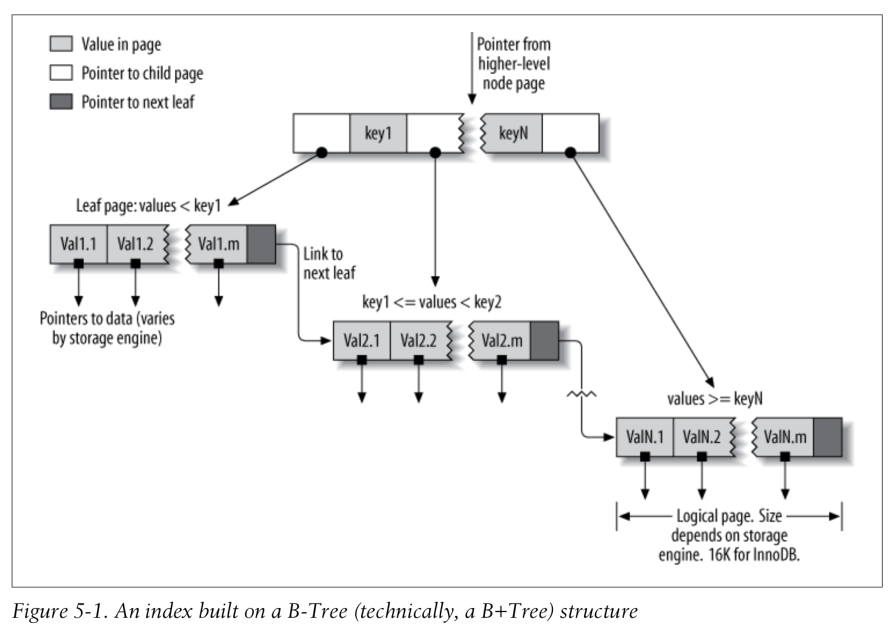
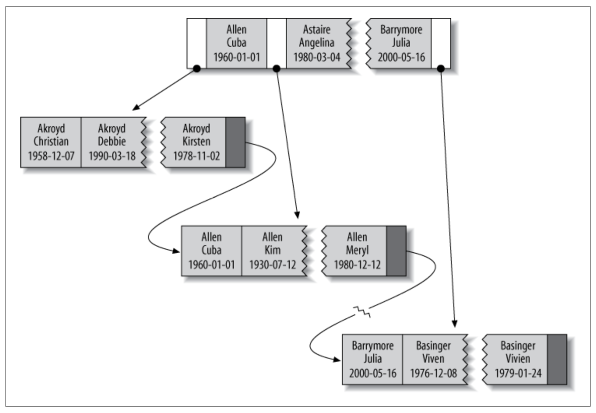

# Chap.5 Indexing for High Performance

* **Indexes** are data structures that storage engines use to find rows quickly.

## Indexing Basics
* actor_id = 5인 row를 찾는 경우
  - index가 actor_id column에 있으면, index를 사용하여 조건에 맞는 row를 찾는다.
  
```sql
SELECT first_name FROM sakila.actor WHERE actor_id = 5;
```

* index는 테이블에 있는 하나 또는 여러개의 column의 value로 만들어 짐.
  - 여러 개의 column을 사용할 경우 순서가 중요함 (MySQL은 leftmost prefix로 효과적 검색)

* ORM을 사용할 경우도 index는 중요하다. primary key를 사용한 lookup을 사용하지 않을 경우 ORM도 적절한 Query를 만들지 못하는 경우가 발생할 수 있다. 

### Types of Indexes
* 여러 목적에 따라 적절한 index type이 있음
* Index는 storage engine layer에 구현됨 [MySQL: Server Layer-Storage Engine Layer]
  - 각 engine 별로 index 구현이 조금씩 다름

#### B-Tree Indexes
* [B-tree](https://en.wikipedia.org/wiki/B-tree): 가장 대표적인 index type - 대부분의 storage engine이 지원하는 타입
* CREAT TABLE, CREATE INDEX 등을 사용하여 index 생성시 타입 지정
*  B-Tree를 지정하더라도, storage engine에서 내부적 구현의 차이 존재
  - Ex) NDB Cluster Engine: 네트워크 데이터 분산 지원 스토리지 엔진, [T-Tree](https://en.wikipedia.org/wiki/T-tree) 사용 
  - Ex) InnoDB: [B+Tree](https://en.wikipedia.org/wiki/B%2B_tree) 사용
* B-Tree index
  - root node에서 시작, root node의 slot에는 child node의 pointer를 가지고 있음 (upper/lower bounds)
  - 각 leaf page가 root node로 부터 같은 거리에 있음
  - root 와 leaves 사이에 여러 level의 node pages가 존재함, Depth는 Table의 크기에 영향을 받음
  - Leaf page는 indexed data를 pointing 하고 있음
  - indexed column을 순서대로 저장하여, data의 range를 검색하는데 유용함.

  

* B-Tree 예시
  - index를 last_name, first_name, dob column을 이용하여 만들기

  ```sql
  CREATE TABLE People (
    last_name   varchar(50)       not null,
    first_name  varchar(50)       not null,
    dob         date              not null,
    gender      enum('m', 'f')    not null,
    key(last_name, first_name, dob)
  );
  ```

  

#### Types of queries that can use a B-Tree index
* B-Tree index는 full key value, key range, key prefix로 검색할 때 효과가 있음.
* 유용한 query 종류 
  - Match the full value: index를 구성하는 모든 column을 조건으로 사용
  - Match a leftmost prefix: index를 구성하는 첫번째 column을 조건으로 사용  
  - Match a column prefix: index를 구성하는 column의 앞부분을 조건으로 사용
  - Match a range of values: index를 구성하는 column을 범위를 조건으로 검색
  - Match one part exactly and match a range on another part: index를 구성하는 첫번째 column을 exact match, 두번째 column을 range match 
  - Index-only queries: index에 포함된 column만 조회하는 경우 (Covering Indexes 와 연관) 
* B Tree index의 장점: 정렬이 되어 있기 때문에 값을 찾거나 ORDER BY query에 강점.
* B Tree index의 limitations (**index를 구성하는 column의 순서**)
  - indexed column의 leftmost side로 시작되지 않는 검색에는 불리함
  - index를 구성하는 column들을 제외하고 검색할 수 없음. (last_name과 dob만 이용하여 검색할 경우 dob는 index를 이용하지 못함)
  - range condition의 다음에 오는 조건은 index를 이용하지 못함 (WHERE last_name="Smith" AND first_name LIKE 'J%' AND dob='1976-12-23')
* 성능 최적화를 위해 같은 column들을 가지고 서로 다른 순서로 index를 만들기도 함.

#### Hash indexes
* Hash index: [Hash Table](https://en.wikipedia.org/wiki/Hash_table)을 기반으로 만들어진 index
  - exact match 값을 찾을때 효율적임
  - indexed column으로 부터 hash code를 계산하여 index를 생성함
  - MySQL에서는 Memory storage engine만이 명시적으로 지원함
  - Hash code가 같을 경우 linked list를 사용함
  - index가 hash value만 저장하기 때문에 index가 size가 작고, 비교적 빠르다.
  
  ```sql
  -- fname의 hash code값에 해당하는 slot에 value의 pointer를 저장
  CREATE TABLE testhash (
    fname   VARCHAR(50)   NOT NULL,
    lname   VARCHAR(50)   NOT NULL,
    KEY USING HASH(fname) 
  ) ENGINE=MEMORY;
  ```
  
* Hash index의 limitations
  - index는 hash value만 가지고 있으므로, index만 이용하여 값을 조회할 수 없음
  - row가 정렬되지 않은 순서로 저장되므로, sorting에 사용할 수 없음
  - partial key matching을 지원하지 않음
  - equality comparison만을 지원함 ```=, IN(), <=>```
  - hash collisions가 많이 발생할 경우, 같은 hash value의 linked list를 각각 비교하여 값을 찾게됨
  - hash collisions가 많이 발생할 경우, index maintenance 시 느려지는 문제 발생

* Adaptive hash indexes: InnoDB의 경우 B-Tree 위에 hash index를 만들어 함께 사용하는 방식

#### Building your own hash indexes
* Storage engine에서 hash index를 지원하지 않을때 비슷하게 InnoDB에서 사용하는 방법
  - pseudo hash index를 B-Tree index위에 만듬
  - key value 대신 key의 hash value를 lookup 할때 사용한다.
  - SHA1() or MD5() hash function을 사용하지 않는다 (길이가 길어 차지하는 공간도 크고, 비교에 시간이 오래 걸림)
  - CRC32()를 사용, collision이 많이 발생할 경우 64 bit hash function을 만들어 사용한다. ```CONV(RIGHT(MD5('http://www.mysql.com/'), 16), 16, 10)```
  
  ```sql
  SELECT id FROM url WHERE url="http://www.mysql.com";

  SELECT id FROM url WHERE url="http://www.mysql.com" AND url_crc=CRC32("http://www.mysql.com");
  ```

  ```sql
  CREATE TABLE pseudohash (
    id int unsigned NOT NULL auto_increment,
    url varchar(255) NOT NULL, 
    url_crc int unsigned NOT NULL DEFAULT 0,
    PRIMARY KEY(id)
  );

  -- trigger

  DELIMITER //

  CREATE TRIGGER pseudohash_crc_ins BEFORE INSERT ON pseudohash FOR EACH ROW BEGIN SET NEW.url_crc=crc32(NEW.url);
  END;
  //

  CREATE TRIGGER pseudohash_crc_upd BEFORE UPDATE ON pseudohash FOR EACH ROW BEGIN SET NEW.url_crc=crc32(NEW.url);
  END;
  //
  ```

#### Handling hash collisions
* Hash collision 발생시 같은 hash value값을 가진 row가 하나 이상 있을 수 있으므로, key value와 함께 조회 한다. 

  ```sql
  SELECT id FROM url WHERE url_crc=CRC32("http://www.mysql.com") AND url="http://www.mysql.com";
  ```

#### Spatial (R-Tree) indexes
* [Spatial indexes](https://en.wikipedia.org/wiki/Grid_(spatial_index))
* index를 모든 dimemsion에 대해서 동시에 생성하므로 어떠한 조합에도 효과적으로 리턴함
* GIS에서 사용함, MySQL에서는 효율적이지 못함, PostGIS (PostgreSQL) 추천

#### Full-text indexes
* Full-text index: text에 있는 keyword를 찾을 수 있도록 index하는 방법, Search Engine과 유사한 기능
* ```MATCH AGAINST``` operation을 사용하여 검색

## Benefits of Indexes
* 