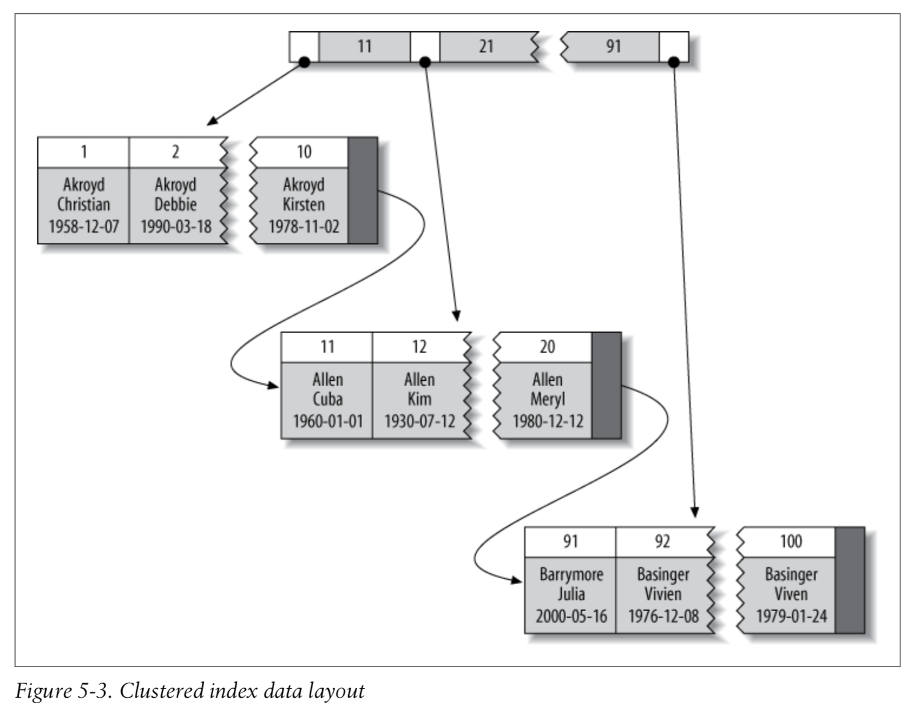
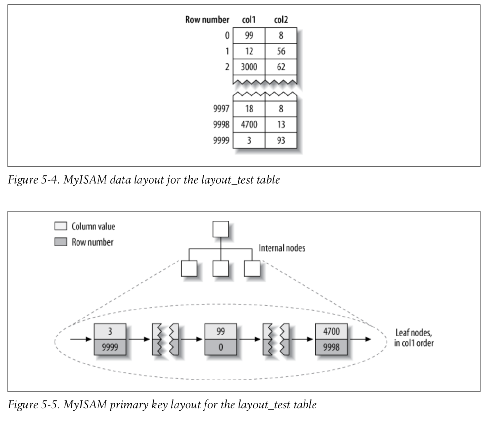
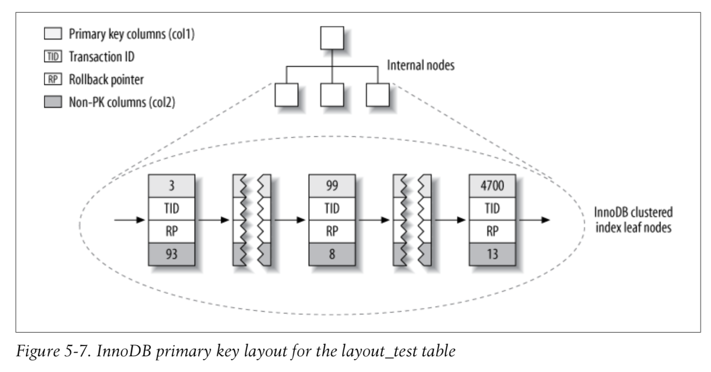
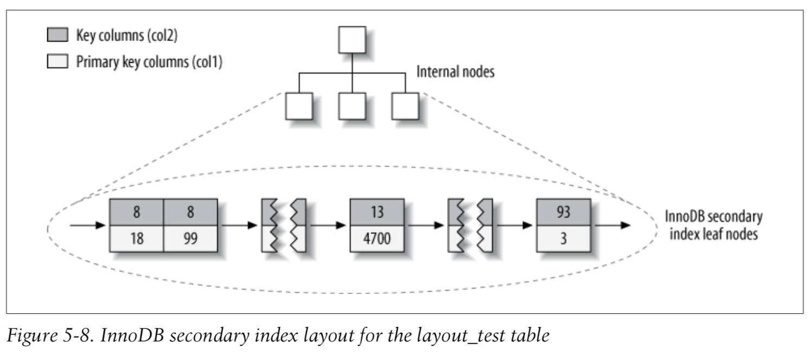
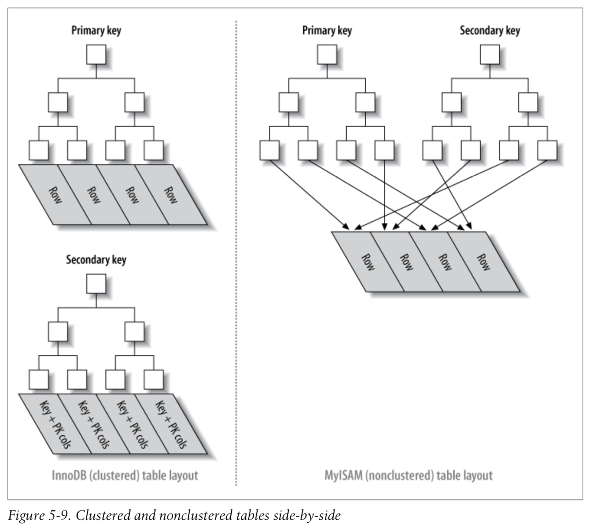
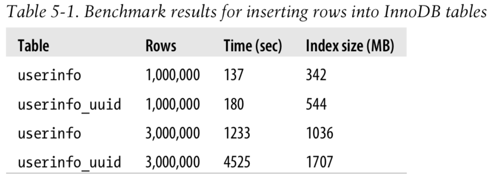
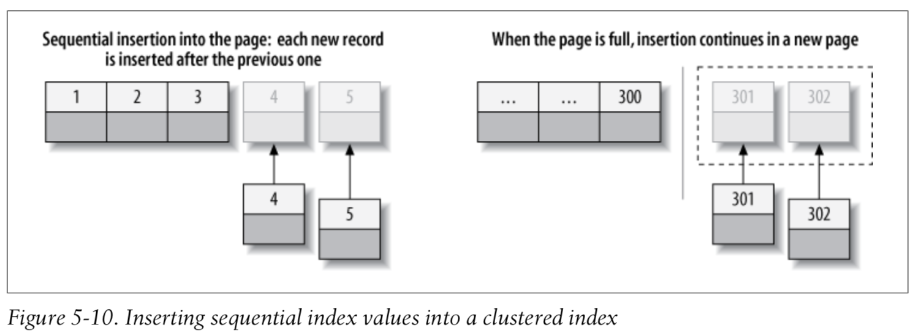
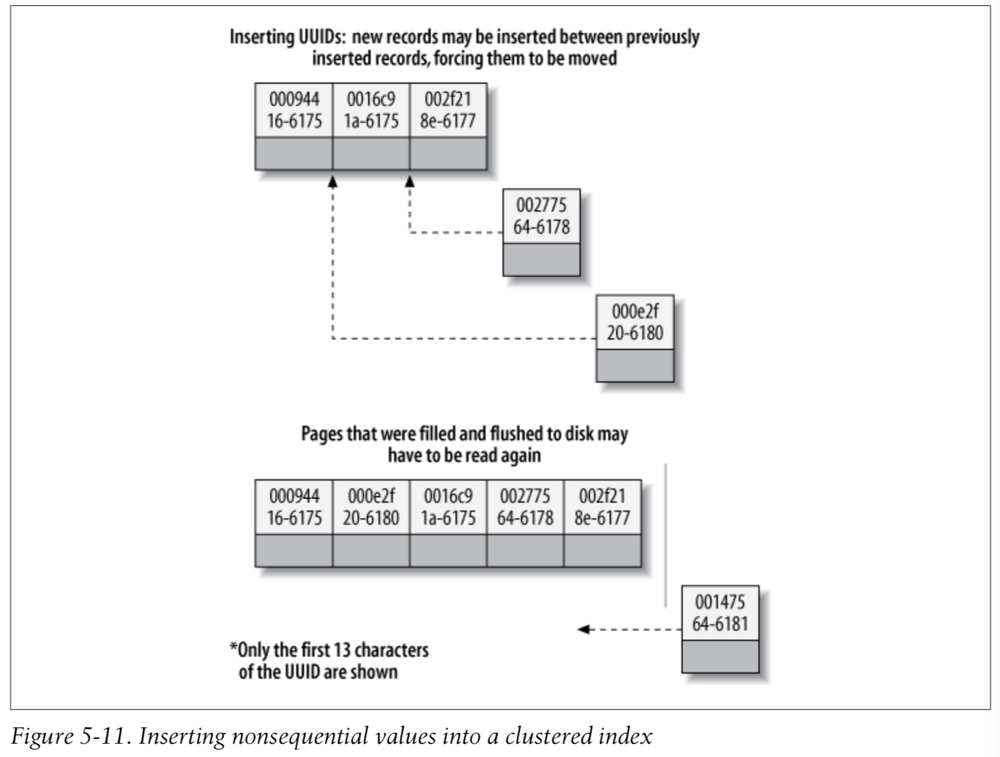

# Chap.5 Indexing for High Performance

* **Indexes** are data structures that storage engines use to find rows quickly.

## Indexing Basics
* actor_id = 5인 row를 찾는 경우
  - index가 actor_id column에 있으면, index를 사용하여 조건에 맞는 row를 찾는다.
  
```sql
SELECT first_name FROM sakila.actor WHERE actor_id = 5;
```

* index는 테이블에 있는 하나 또는 여러개의 column의 value로 만들어 짐.
  - 여러 개의 column을 사용할 경우 순서가 중요함 (MySQL은 leftmost prefix 검색)

* ORM을 사용할 경우도 index는 중요하다. primary key를 사용한 lookup을 사용하지 않을 경우 ORM도 적절한 Query를 만들지 못하는 경우가 발생할 수 있다. 

### Types of Indexes
* 여러 목적에 따라 적절한 index type이 있음
* Index는 storage engine layer에 구현됨 [MySQL: Server Layer-Storage Engine Layer]
  - 각 engine 별로 index 구현이 조금씩 다름

#### B-Tree Indexes
* [B-tree](https://en.wikipedia.org/wiki/B-tree): 가장 대표적인 index type - 대부분의 storage engine이 지원하는 타입
* CREAT TABLE, CREATE INDEX 등을 사용하여 index 생성시 타입 지정
*  B-Tree를 지정하더라도, storage engine에서 내부적 구현의 차이 존재
  - Ex) NDB Cluster Engine: 네트워크 데이터 분산 지원 스토리지 엔진, [T-Tree](https://en.wikipedia.org/wiki/T-tree) 사용 
    - T-Tree: AVL-Tree의 이진 탐색 특성 및 높이 균형과 B-Tree의 업데이트와 저장 효율(한 노드에 여러개의 데이터를 가짐)을 가지는 메모리 기반의 DBMS에서 주로 사용되는 index algorithm
  - Ex) InnoDB: [B+Tree](https://en.wikipedia.org/wiki/B%2B_tree) 사용
* B Tree vs B+ Tree
  - B+ Tree: 중간 node에 key만 있고, value pair를 포함하지 않음
  - B+ Tree: Leaf nodes간 linked 되어 있어, 순차적으로 탐색하기 용이함 
* B-Tree index
  - root node에서 시작, root node의 slot에는 child node의 pointer를 가지고 있음 (upper/lower bounds)
  - 각 leaf page가 root node로 부터 같은 거리에 있음
  - root 와 leaves 사이에 여러 level의 node pages가 존재함, Depth는 Table의 크기에 영향을 받음
  - Leaf page는 indexed data를 pointing 하고 있음
  - indexed column을 순서대로 저장하여, data의 range를 검색하는데 유용함.

  

* B-Tree 예시
  - index를 last_name, first_name, dob column을 이용하여 만들기

  ```sql
  CREATE TABLE People (
    last_name   varchar(50)       not null,
    first_name  varchar(50)       not null,
    dob         date              not null,
    gender      enum('m', 'f')    not null,
    key(last_name, first_name, dob)
  );
  ```

  

#### Types of queries that can use a B-Tree index
* B-Tree index는 full key value, key range, key prefix로 검색할 때 효과가 있음.
* 유용한 query 종류 
  - Match the full value: index를 구성하는 모든 column을 조건으로 사용
  - Match a leftmost prefix: index를 구성하는 첫번째 column을 조건으로 사용  
  - Match a column prefix: index를 구성하는 column의 앞부분을 조건으로 사용
  - Match a range of values: index를 구성하는 column을 범위를 조건으로 검색
  - Match one part exactly and match a range on another part: index를 구성하는 첫번째 column을 exact match, 두번째 column을 range match 
  - Index-only queries: index에 포함된 column만 조회하는 경우 (Covering Indexes 와 연관) 
* B Tree index의 장점: 정렬이 되어 있기 때문에 값을 찾거나 ORDER BY query에 강점.
* B Tree index의 limitations (**index를 구성하는 column의 순서**)
  - indexed column의 leftmost side로 시작되지 않는 검색에는 불리함
  - index를 구성하는 column들의 순서 일부를 제외하고 검색할 수 없음. (last_name과 dob만 이용하여 검색할 경우 dob는 first_name을 사용하지 않을 경우 index를 이용하지 못함)
  - range condition의 다음에 오는 조건은 index를 이용하지 못함 (WHERE last_name="Smith" AND first_name LIKE 'J%' AND dob='1976-12-23')
* 성능 최적화를 위해 같은 column들을 가지고 서로 다른 순서로 index를 만들기도 함.

#### Hash indexes
* Hash index: [Hash Table](https://en.wikipedia.org/wiki/Hash_table)을 기반으로 만들어진 index
  - exact match 값을 찾을때 효율적임
  - indexed column으로 부터 hash code를 계산하여 index를 생성함
  - MySQL에서는 Memory storage engine만이 명시적으로 지원함
  - Hash code가 같을 경우 linked list를 사용함
  - index가 hash value만 저장하기 때문에 index가 size가 작고, 비교적 빠르다.
  
  ```sql
  -- fname의 hash code값에 해당하는 slot에 value의 pointer를 저장
  CREATE TABLE testhash (
    fname   VARCHAR(50)   NOT NULL,
    lname   VARCHAR(50)   NOT NULL,
    KEY USING HASH(fname) 
  ) ENGINE=MEMORY;
  ```
  
* Hash index의 limitations
  - index는 hash value만 가지고 있으므로, index만 이용하여 값을 조회할 수 없음
  - row가 정렬되지 않은 순서로 저장되므로, sorting에 사용할 수 없음
  - partial key matching을 지원하지 않음
  - equality comparison만을 지원함 ```=, IN(), <=>```
  - hash collisions가 많이 발생할 경우, 같은 hash value의 linked list를 각각 비교하여 값을 찾게됨
  - hash collisions가 많이 발생할 경우, index maintenance 시 느려지는 문제 발생

* Adaptive hash indexes: InnoDB의 경우 B-Tree 위에 hash index를 만들어 함께 사용하는 방식

#### Building your own hash indexes
* Storage engine에서 hash index를 지원하지 않을때 비슷하게 InnoDB에서 사용하는 방법
  - pseudo hash index를 B-Tree index위에 만듬
  - key value 대신 key의 hash value를 lookup 할때 사용한다.
  - SHA1() or MD5() hash function을 사용하지 않는다 (길이가 길어 차지하는 공간도 크고, 비교에 시간이 오래 걸림)
  - CRC32()를 사용, collision이 많이 발생할 경우 64 bit hash function을 만들어 사용한다. ```CONV(RIGHT(MD5('http://www.mysql.com/'), 16), 16, 10)```
  
  ```sql
  SELECT id FROM url WHERE url="http://www.mysql.com";
  -- hash value가 동일할 수 있으므로, 원래 값과 함께 검색한다.
  SELECT id FROM url WHERE url="http://www.mysql.com" AND url_crc=CRC32("http://www.mysql.com");
  ```

  ```sql
  CREATE TABLE pseudohash (
    id int unsigned NOT NULL auto_increment,
    url varchar(255) NOT NULL, 
    url_crc int unsigned NOT NULL DEFAULT 0,
    PRIMARY KEY(id)
  );

  -- trigger

  DELIMITER //

  CREATE TRIGGER pseudohash_crc_ins BEFORE INSERT ON pseudohash FOR EACH ROW BEGIN SET NEW.url_crc=crc32(NEW.url);
  END;
  //

  CREATE TRIGGER pseudohash_crc_upd BEFORE UPDATE ON pseudohash FOR EACH ROW BEGIN SET NEW.url_crc=crc32(NEW.url);
  END;
  //
  ```

#### Handling hash collisions
* Hash collision 발생시 같은 hash value값을 가진 row가 하나 이상 있을 수 있으므로, key value와 함께 조회 한다. 

  ```sql
  SELECT id FROM url WHERE url_crc=CRC32("http://www.mysql.com") AND url="http://www.mysql.com";
  ```

#### Spatial (R-Tree) indexes
* [Spatial indexes](https://en.wikipedia.org/wiki/Grid_(spatial_index))
* index를 모든 dimemsion에 대해서 동시에 생성하므로 어떠한 조합에도 효과적으로 리턴함
* GIS에서 사용함, MySQL에서는 효율적이지 못함, PostGIS (PostgreSQL) 추천

#### Full-text indexes
* Full-text index: text에 있는 keyword를 찾을 수 있도록 index하는 방법, Search Engine과 유사한 기능
* ```MATCH AGAINST``` operation을 사용하여 검색

## Benefits of Indexes
* B-Tree Index는 정렬되어 있어 비슷한 값들이 인접해 있기 때문에 ```ORDER BY``` 나 ```GROUP BY```에도 효과적임.
* Index의 Benefits
  - Index는 서버가 확인해야 할 데이터 양을 줄여준다.
  - Index는 서버가 sorting 및 temporary table을 추가로 사용하지 않도록 한다.
  - Index는 random I/O를 sequential I/O로 접근할 수 있도록 한다.
* Three-star system for index
  - one star: index가 관련된 rows를 각각 인접하게 위치
  - second star: index가 rows를 query에서 필요한 순서로 sorted 되어 있음
  - final star: index에 query에 필요한 모든 column이 포함되어 있음 
* Is an Index the Best Solution?
  - 매우 큰 table에서는 index를 생성하는 작업 자체가 overhead가 발생할 수 있으므로, row를 group으로 나누어 partitioning을 사용하는 것이 효과적일 수 있다. 

## Indexing Strategies for High Performance
* 효과적인 index를 선택하는 방법 및 Performance를 평가하는 방법

### Isolating the Column
* Column들이 isolated 되지 않으면 index를 사용할 수 없음.
  - Isolating: column이 expression의 부분이 아니고, function의 내부에 없는 경우

  ```sql
  -- mistakes
  SELECT actor_id FROM sakila.actor WHERE actor_id + 1 = 5;
  SELECT ... WHERE TO_DAYS(CURRENT_DATE) - TO_DAYS(date_col) <= 10;
  ```

### Prefix Indexes and Index Selectivity
* Prefix Indexes
  - 매우 긴 character columns를 index할 경우 index가 매우 커지고, 느리는 문제점
  - 전체 대신 Column의 앞부분만을 index 하여 속도 향상 및 적은 공간을 사용하도록 함 (less selective하게 됨)
  - 적절한 index selectivity를 보장할 수 있을 만큼 prefix의 길이를 정함
  - Prefix size를 찾는 방법
    - prefix size를 증가 시키면서 column의 전체 사이즈와 유사한 Index Selectivity를 가지는, 다시 말해서 가장 많이 나타나는 값의 count가 유사하도록 설정
    - average selectivity외에 worst-case selectivity도 중요함

    ```sql
    SELECT COUNT(*) AS cnt, LEFT(city, 3) AS pref FROM sakila.city_demo GROUP BY pref ORDER BY cnt DESC LIMIT 10;

    -- prefix average selectivity
    SELECT COUNT(DISTINCT city)/COUNT(*) FROM sakila.city_demo;
    ```
  - Prefix index 만들기 

    ```sql
    ALTER TABLE sakila.city_demo ADD KEY (city(7));
    ```
  - 단점: MySQL에서는 ```ORDER BY```나 ```GROUP```에 prefix index를 사용하지 못하고, covering index로도 사용하지 못함

* Index Selectivity (1/#T ~ 1)
  - the ratio of the number of distinct indexed values(the cardinality) to the total number of rows in the table(#T)
  - unique index: selectivity is 1
  - index selectivity가 높은 것이 좋음
* Suffix index: MySQL에서는 지원하지 않음, reversed string을 저장하고, prefix index를 사용하여 구현할 수 있음.

### Multicolumn Indexes
* Multicolumn Indexes시 mistakes
  - 너무 많은 column이나 모든 column을 각각 index: Performance 향상에 도움이 되지 않음
  - column을 잘못된 순서로 index
  
    ```sql
    CREATE TABLE t (
      c1 INT,
      c2 INT, 
      c3 INT,
      KEY(c1),
      KEY(c2),
      KEY(c3)
    );
    ```

* index merge 기능으로 MySQL에서는 하나의 테이블에서 multiple index를 제한적으로 사용하게 함: CPU, Memory를 과다하게 사용
  - MySQL에서는 index merge를 이용하는 3가지 경우가 있음
    - union for ```OR``` conditions
      - Extra column을 이용함. buffering, sorting, index merging에 많은 자원을 사용하게 됨
    - intersection for ```AND``` conditions
      - 모든 column에 관련 있는 하나의 index를 사용하는 것이 더 나음.
    - unions of intersections for combinations of the two

    ```sql
    -- film_actor, film_id 모두에 index가 있음
    SELECT film_id, actor_id FROM sakila.film_actor
    WHERE actor_id = 1 OR film_id = 1;
    ```
    
  - ```IGNORE INDEX```로 index merge를 disable 할 수 있음

### Choosing a Good Column Order
* Multicolumn index: the order of columns in an index
* B-Tree Index를 사용할 경우 columns의 index order를 row가 어떻게 sorted 되고 grouped 될지에 고려해야 함. ```ORDER BY```, ```GROUP BY```, ```DISTINCT```
* Index column order를 결정 방법
  - 대체적으로 selective column(high selectivity)을 선택
    - sorting이나 grouping이 없는 경우는 효과적
    - 어떤 경우에서는 random I/O와 sorting을 고려하는 것이 더 효과적임
  - Higer selectivity한 column을 index의 first column으로 선택
    - pt-query-digest에서 worst sample query를 기준으로 하면 효과적임
    - 모든 average-case performance가 special-case performance에 해당 될 수 는 없음

    ```sql
    -- higher selectivity한 column을 first index (적은 row를 리턴) 
    SELECT * FROM payment WHERE staff_id = 2 AND customer_id = 584;

    -- 특정 조건에 따라 selectivity는 다를 수 있음
    SELECT SUM(staff_id = 2), SUM(customer_id = 584) FROM payment\G
    -- SUM(staff_id = 2): 7992
    -- SUM(customer_id = 584): 30 (customer_id) => first in the index

    -- cardinality 직접 구해서 판단
    SELECT COUNT(DISTINCT staff_id)/COUNT(*) AS staff_id_selectivity,
    COUNT(DISTINCT customer_id)/COUNT(*) AS customer_id_selectivity,
    COUNT(*)
    FROM payment\G
    --    staff_id_selectivity: 0.0001
    -- customer_id_selectivity: 0.0373 <- higer selectivity, first column index
    --                COUNT(*): 16049

    ALTER TABLE payment ADD KEY(customer_id, staff_id);
    ```
* selectivity와 cadinality 뿐만 아니라, sorting, grouping, WHERE 안의 range condition도 query performace에 큰 영향을 미침

### Clusterd Indexes
* Clustered indexes: index의 type이 아니라 data storage에 대한 접근 방식
  - InnoDB의 index는 B-Tree index와 rows를 함께 같은 structure에 저장 (I/O 개선)
  - InnoDB의 경우 primary key에 대해서 clustered index를 적용함
    - primary key를 지정하지 않을 경우, 다른 unique nonnullable index를 사용하려고 하고, 그것도 없는 경우 hidden primary key를 만들어 cluster 한다.
  - Table에 하나만 지정될 수 있음
  - Row가 index의 leaf pages에 저장되어, rows가 index column의 순으로 정렬되어 인접하게 저장된다.
  - Performance에 도움을 줄 수 있지만 때로는 Performance에 문제도 발생시킬 수 있음

  

  - Clustered index의 advantages
    - 연관된 데이터를 함께 읽고, 저장할 수 있다.
    - Data access가 빠르다.
    - Covering index를 사용하는 Query의 경우 leaf node의 primary key 값을 사용할 수 있다. 
  - Clustered index의 disadvantages
    - Clustering은 I/O 개선에 큰 영향을 주나, data가 memory에 충분히 적재될 경우 장점이 두드러지지 않음
    - Insert 속도는 insertion order에 영향을 많이 받음. primary key order로 insert 할 경우가 가장 빠름 (```OPTIMIZE TABLE```을 사용하여 재 정렬)
    - Clustered index column을 update하는 것은 비용이 과다함 (InnoDB의 경우 새로운 위치에 이동 생성)
    - Table에 Row가 insert되거나 update 될 경우 page splits가 발생하면, row는 모두 하나의 page내에 위치해야 하므로, 추가로 page가 생성되어 disk space를 좀 더 사용하게 된다.
    - Table full scan시 page split으로 rows가 less densely packed 되거나 nonsequentially 할 경우 느려짐
    - Secondary (nonclustered) index는 primary key column을 reference로 추가로 저장해야 하기 때문에 커질 수 있음 (row pointer는 변경될 수 있기 때문에 reference로 사용될 수 없음)
    - Secondary index는 데이터를 access하기 위해서 clustered index를 추가로 access 해야함

#### Comparison of InnoDB and MyISAM data layout
* clustered and nonclustered data layouts
  - primary and secondary indexes
  
  ```sql
  -- primary key values col1 1 to 10000
  -- col2 between 1 and 100
  CREATE TABLE layout_test (
    col1 int NOT NULL,
    col2 int NOT NULL,
    PRIMARY KEY(col1), 
    KEY(col2)
  );
  ```

* MyISAM's data layout
  - Rows를 disk에 insert된 순서로 저장
  - 별도의 row number를 유지, row를 fixed length로 하여 row number 계산
  - leaf nodes에는 row number와 해당 column 값만 저장한다. 
  - 다른 column(col2)의 index도 동일한 방식으로 저장됨

  
  
* InnoDB's data layout
  - Rows를 Clustered 된 형태로 저장
  - 전체 row가 Clustered index의 leaf node에 저장됨 (Clustered index = table)
  - Secondary Index의 leaf node에는 primary key values가 저장됨

  

  

  

* Inserting rows in primary key order with InnoDB
  - surrogate key
    - application data에 관계되지 않는 value의 primary key
    - InnoDB를 사용하고, 특별히 clustering이 필요하지 않는 경우
    - ```AUTO_INCREMENT``` column을 사용
    - random한 primary key를 사용하는 것인 I/O bound workloads에 좋지 않음
      - ex: UUID
      - clutered index를 random하게 insert하게 만드는 최악의 경우가 발생할 수 있음
    
    

  - Inserting sequential primary key values
    - primary key pages are packed nearly full with in-ordered records

  

  - Inserting random primary key values
    - primary key value를 existing data의 중간에 넣기 위한 추가 작업이 소요됨
    - drawbacks
      - Destination page가 disk에 flush되고, cache가 removed 됨. Disk I/O 증가
      - Insertion이 순서 없이 되므로, 공간을 확보하기 위해 자주 page split가 일어남
      - final data is fragmented

  

* When Primary Key Order Is Worse
  - High-concurrency workloads에서 primary key insert가 경합 및 AUTO_INCREMENT lock이 성능에 영향을 미치게 됨
  - [innodb_autoinc_lock_mode](https://mariadb.com/kb/en/library/auto_increment-handling-in-xtradbinnodb/) 설정을 조정한다.