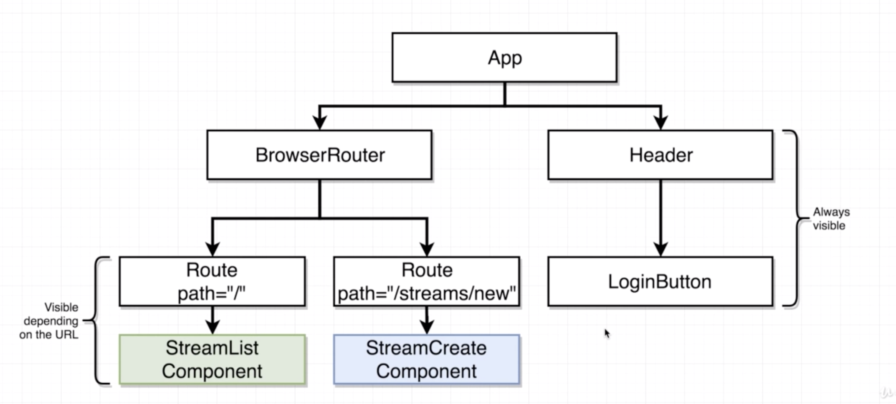
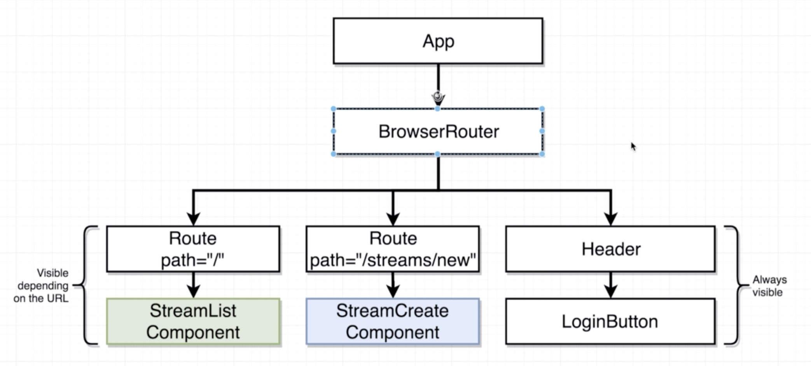

# Navigation with React Router

## App Outline
* Site
  - https://www.twitch.tv
* Real Time Messaging Protocol (RTMP) Server
  

## App Challenges
* **Need to be able to navigate around to seperate pages in our app**
* Need to allow a user to login/logout
* Need to handle forms in Redux
* Need to master CRUD operations in React/Redux
* Errors will likely occur! Need good error handling

## Introducing React Router
* react-router family
  - `react-router`: Core navigation lib
  - `react-router-dom`: Navigation for dom-based-apps
  - `react-router-native`: Navigation for react-native apps
  - `react-router-redux`: Bindings between Redux and React Router
* Add `react-router-dom`
  ```
  npm install --save react-router-dom
  ```

## How React Router Works
* React Router
  

## How Paths Get Matched [7ee6de07c6ad2baccd10266aa66ce60bedb62a08]
* Path match 방식
  - path에 match하는 component는 모두 rendering 됨
  - `extractedPath.contains(path)`
* Duplicate PageOne Route
  ```html
  <BrowserRouter>
    <div>
      <Route path="/" exact component={PageOne} />
      <Route path="/" exact component={PageOne} />
  ```
* `/pagetwo` PageOne, PageTwo 모두 출력
  ```html
  <BrowserRouter>
    <div>
      <Route path="/" component={PageOne} />
      <Route path="/pagetwo" component={PageTwo} />
  ```
* `exact` keyword
  - `extractedPath === path`

## How to *Not* Navigate with React Router [3d0bfb804cfc85977fb9c9d3b31950b43075e03a]
* anchor tag를 이용한 react router 간 이동
  - **BAD!!**: 클릭하여 페이지 이동시 마다 페이지를 서버에서 받아와 이전 html을 없애고 새로 App을 로딩하게 됨 (기존에 react가 가지고 있던 데이터는 모두 삭제됨)
  ```html
  <a href='/'>Navigate to Page One</a>
  ```

## Navigating with React Router [8a3d28187e4d630503781913974776b692504c26]
* `Link`
  - html anchor tag 대신 React에서 사용
  - React App 내에서 route되고, 서버로 새로운 요청이 발생하지 않음
* 동작 방식
  - html은 anchor tag로 rendering 되나, 클릭 시 React Router가 browser가 서버에 새로운 페이지를 호출하는 것을 막음
  - URL은 변경되나, `History`에서 update URL을 `BrowserRouter`로 보내어 해당하는 `Route` component를 실행하게 함

## [Optional] - Different Route Types
* Router types
  - `BrowserRouter`: `localhost:3000/pagetwo` -> `/pagetwo`
  - `HashRouter`: `localhost:3000/#/pagetwo` -> `/#/pagetwo`
    - [2cedb051378a3258f5cfed714dd1b6341b1e1c9b]
  - `MemoryRouter`: `localhost:3000` don't use URL to track navigation
    - [be960ee397bd0c0337a907cc0d36a60c9a64bdd2]
* Route Path가 없을 경우 서버 response
  * Traditional Web Application Server
    - route path를 찾지 못할 경우 404 Error를 return함
  * Create-React-App Dev Server (React App)
    - route path가 resource와 public dir에 없으면 index.html를 일단 return함
    - 모든 route path가 client에 로딩되는 js파일에 설정되어 있기 때문임
    - server에서는 route path를 알지 못함
* App deploy 설정 관계
  - `BrowserRouter`: 모든 deploy 방식에서 일반적으로 지원
  - `HashRouter`: `#`는 client에서만 사용되므로, 서버에는 `localhost:3000`만 호출되고, 그 뒤의 url은 호출되지 않음, 별도의 server에 route 설정이 필요없음
  - `MemoryRouter`: 별도의 server에 route 설정이 필요없음

## Component Scaffolding [67ea06705035d1fb59432983f8e13e60e5a32548]
* path - React Components
  - `/`: StreamList
  - `/streams/new`: StreamCreate
  - `/streams/edit`: StreamEdit
  - `/streams/delete`: StreamDelete
  - `/streams/show`: StreamShow

## Always Visible Components [0161cb2159075803db5b1e6c4a4ec08e014e44c3]
* Components Hierachy
  
* Always Visible Components
  - `Header`, `LoginButton` Components
  - `BrowserRouter` 외부에 위치

## Connecting the Header [65f0faf18577e7858030054add8eeb3816e92068]
* Add Link to Header
  - `You should not use <Link> outside a <Router>`

## Links inside Router [d0e73313c516432d977b24648fea6460c85d1331]
* Header를 BrowserRouter 안으로 이동
  
