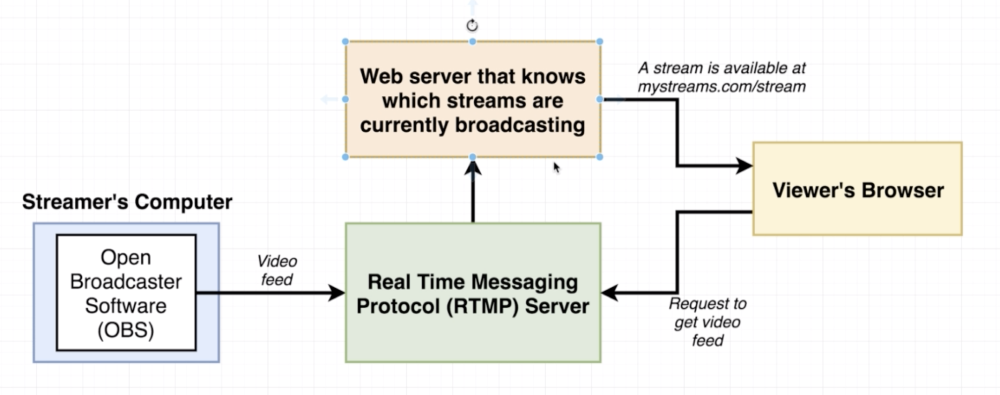
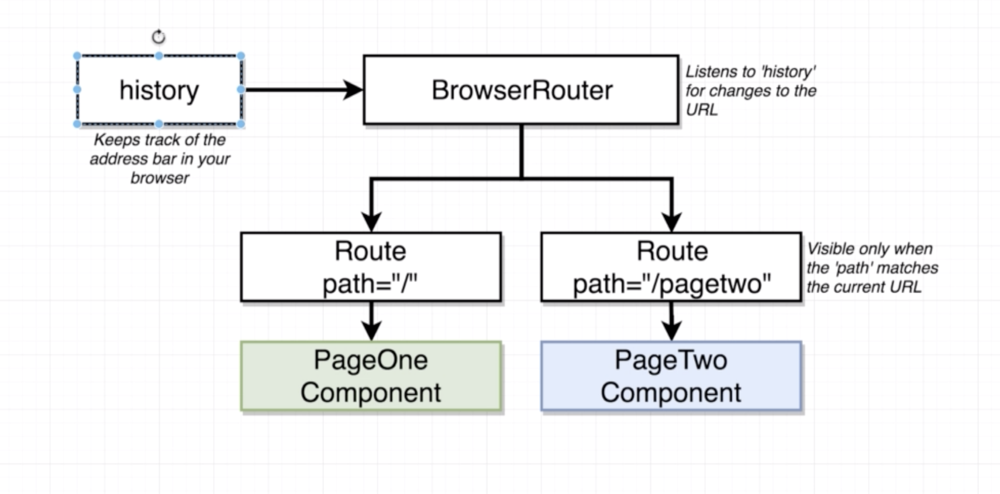

# Navigation with React Router

## App Outline
* Site
  - https://www.twitch.tv
* Real Time Messaging Protocol (RTMP) Server
  

## App Challenges
* **Need to be able to navigate around to seperate pages in our app**
* Need to allow a user to login/logout
* Need to handle forms in Redux
* Need to master CRUD operations in React/Redux
* Errors will likely occur! Need good error handling

## Introducing React Router
* react-router family
  - `react-router`: Core navigation lib
  - `react-router-dom`: Navigation for dom-based-apps
  - `react-router-native`: Navigation for react-native apps
  - `react-router-redux`: Bindings between Redux and React Router
* Add `react-router-dom`
  ```
  npm install --save react-router-dom
  ```

## How React Router Works
* React Router
  

## How Paths Get Matched
* Path match 방식
  - path에 match하는 component는 모두 rendering 됨
  - `extractedPath.contains(path)`
* Duplicate PageOne Route
  ```html
  <BrowserRouter>
    <div>
      <Route path="/" exact component={PageOne} />
      <Route path="/" exact component={PageOne} />
  ```
* `/pagetwo` PageOne, PageTwo 모두 출력
  ```html
  <BrowserRouter>
    <div>
      <Route path="/" component={PageOne} />
      <Route path="/pagetwo" component={PageTwo} />
  ```
* `exact` keyword
  - `extractedPath === path`

## How to *Not* Navigate with React Router
* anchor tag를 이용한 react router 간 이동
  - **BAD!!**: 클릭하여 페이지 이동시 마다 페이지를 서버에서 받아와 이전 html을 없애고 새로 App을 로딩하게 됨
  ```html
  <a href='/'>Navigate to Page One</a>
  ```
