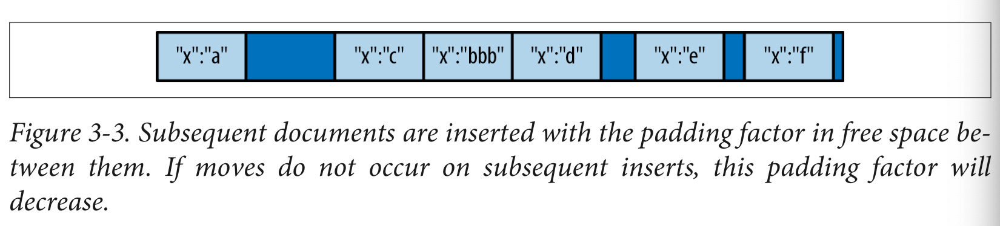

# Chap 1. Introduction
* Mongo DB의 주요 설계 특징
  - Ease of Use
    - document-oriented database
    - no predefined schemas
  - Easy Scaling
    - scale out
    - add new machine & auto scaling
  - Tons of Features
    - 다양한 Indexing 방법
    - Aggregation pipeline
    - Special collection types
    - File storage (large file)
  - Without Sacrificing Speed

# Chap 2. Getting Started
* Basic concepts
  - `document`: basic unit of data
  - `collection`: table with dynamic schema
  - single instance - multiple databases
  - `_id`: unique with in a collection
  - javascript shell

## Documents
* key - values: `{"greeting" : "Hello, world!", "foo": 3}`
  - key: string
  - value: string, integer ..
* key name 유의점
  - key: `\0` (null) character가 없어야 함
  - key에서 `.`, `$`는 특수 용도로 예약되어 있음
* Document 내 key value 특징
  - type-sensitive
  - case-sensitive
  - key-value pairs are ordered

## Collections
* collection: group of documents, like table

### Dynamic Schemas
* 하나의 collection에 여러가지 형태의 documents가 저장될 수 있음
* 같은 key의 경우 같은 type 이여야함

### Naming
* collection name 유의점
  - empty string은 허용 안됨
  - `\0` (null) character는 포함되면 안됨
  - `system`을 prefix는 내부용도로 사용되어 사용할 수 없음
  - `$`는 예약어이므로 사용할 수 없음

#### Subcollections
* collection을 만드는 convention: namespaced subcollections
  - `.`로 분리됨: `blog.authors`, `blog.posts`
  - collection들을 organize 하는 용도외에는 다른 관계는 없음

## Databases
* database: group of collections
  - own permissions
  - disk에 별도로 분리된 파일로 저장되는 단위
* database name 유의점
  - empty string은 안됨
  - 다음 character는 포함될 수 없음: `/,\,/,",*,<,>,:,|,?,$, ,\0`
  - case sensitive (lowercase)
  - max lenght: 64bytes
  - reserved database name
    - `admin`
    - `local`
    - `config`
  - namespace: `cms.blog.posts` (100 bytes 보다 작게)

## Getting and Starting MongoDB
* run `mongod`
  - default data directory: `/data/db/`

## Introduction to the MongoDB Shell
* Javascript shell + Mongodb Client
* run `mongo`
  - basic math & Javascript libraries
  ```
  > x = 200
  > x / 5;
  > Math.sin(Math.PI / 2);
  > new Date('2010/1/1');
  > "Hello, World!".replace("World", "MongoDB");
  > function factorial (n) {
      if (n <= 1) return 1;
      return n * factorial(n - 1);
    }
  > factorial(5);
  ```

### A MongoDB Client
* `db`: current database
* `use foobar`: change database to foobar

### Basic Operations with the Shell

#### Create
* `insert`: add a document to a collection
  - post를 blog collection에 저장
  ```
  > post = {"title" : "My Blog Post",
        "content" : "Here's my blog post.",
        "date" : new Date()}
  > db.blog.insert(post)
  ```

#### Read
* `find` and `findOne`: query a collection
  ```
  > db.blog.findOne()
  ```

#### Update
* `update`: modify document
  - first parameter: find which document
  - second parameter: new document
  ```
  > post.comments = []
  > db.blog.update({title : "My Blog Post"}, post)
  ```

#### Delete
* `remove`: delete document
  ```
  db.blog.remove({title : "My Blog Post"})
  ```

## Data Types

### Basic Data Types
* document: *json-like*
  - json types: null, boolean, numeric, string, array, object
* most common types
  - `null`: `{"x" : null}`
  - `boolean`: `{"x" : true}`
  - `number`: `{"x": 3.14}`, `{"x": 3}`
    - 4-byte integer: `{"x": NumberInt("3")}`
    - 8-byte integer: `{"x": NumberLong("3")}`
  - `string`: `{"x" : "foobar"}`
  - `date`: milliseconds since the epoch `{"x": new Date()}`
  - `regular expression`: query에서 사용할 수 있는 javascript regular expression syntax
    - `{"x" : /foobar/i}`
  - `array`: `{"x" : ["a", "b", "c"]}`
  - `embedded document`
    - `{"x" : {"foo" : "bar"}}`
  - `object id`: 12-byte ID for documents
    - `{"x" : ObjectId()}`
  - `binary data`
  - `code`: javascript code

### Dates
* date object는 `new Date()`와 같이 object로 생성하여 사용
* db에 저장되는 date는 milliseconds since the epoch, no time zone

### Arrays
* 서로 다른 type의 데이터를 담을 수 있음
  - `{"things" : ["pie", 3.14]}`

### Embedded Documents
* information을 좀 더 적절하게 표현 가능
  - person - address
  ```
  {
    "name": "John Doe",
    "address": {
      "street" : "123 Park Street",
      "city" : "Anytown",
      "state" : "NY"
    }
  }
  ```

### _id and ObjectIds
* `_id`
  - 모든 document에 포함되고, 어떤 타입도 될 수 있지만, default는 ObjectId 임
  - 하나의 collection에서 unique 해야함

#### ObjectIds
* `ObjectId`
  - 서로 다른 machine들에서 global unique key를 생성
  - 12 bytes (24 hexadecimal digits) [Timestamp + Machine + PID + Increment]
* Autogeneration of _id
  - `_id`는 client side의 driver에서 document가 insert

## Using the MongoDB Shell
* connect to mongodb (myDB)
  ```
  $ mongo some-host:30000/myDB
  ```
* start mongo shell without connection
  ```
  $ mongo --nodb
  ```
* connect to db
  ```js
  > conn = new Mongo("some-host:30000")
  > db = conn.getDB("myDB")
  ```

### Tips for Using the Shell
* help
  ```
  db.help()   // method help
  help admin  // administrative help
  ```
* `db.foo.update`: print source code for the function

### Running Scripts with the Shell
* run script files
  ```
  $ mongo script1.js script2.js script3.js
  $ mongo --quiet server-1:30000/foo script1.js script2.js script3.js
  > load('script1.js')
  ```
* javascript equivalents to shell helpers
  - db: global variable
  ```
  use foo             db.getSisterDB("foo")
  show dbs            db.getMongo().getDBs()
  show collections    db.getCollectionNames()
  ```
* script로 helper function 만들기
  ```js
  // defineConnectTo.js
  var connectTo = function(port, dbname) {
    if (!port) {
      port = 27017;
    }

    if (!dbname) {
      dbname = "test";
    }

    db = connect("localhost:"+port+"/"+dbname);
    return db;
  }
  ```
  ```js
  > load('defineConnectTo.js)
  > db = connectTo("server1","30000")
  ```

### Creating a .mongorc.js
* .mongorc.js: mongo shell이 시작될 때 자동으로 load 됨
  - global variables를 설정
  - helper function 정의
  - function을 override 하여 사용 가능
  ```js
  var no = function() {
    print("No on my watch.");
  };

  // Prevent dropping databases
  db.dropDatabase = DB.prototype.dropDatabase = no;
  ```

### Cusomizing Your Prompt
* `prompt` (string)
  ```js
  prompt = function() {
    return (new Date())+"> ";
  };
  ```

### Editing Complex Variables
* edit variable with editor `edit varname`
  ```js
  > EDITOR="/usr/bin/emacs"
  > var wap = db.books.findOne({title: "War and Peace"})
  > edit wap
  ```

### Inconvenient Collection Names
* collection을 fetch 할 때 `db.collectionName` 방식으로 사용하게 되어, collection name이 db의 method의 name과 동일한 경우나, javascript property name("$", "_", letters, cannot start with number)으로 사용할 수 없는 형식일 경우 `getCollection` method를 사용해야 하므로 불편할 수 있음.
  ```
  > db.version (x)
  > db.getCollection("version");
  ```
* collection name을 사용할 수 있는 다른 방법
  - `x.y` == `x['y']`
  ```js
  > var name = "@#&!"
  > db[name].find()
  ```

# Chap 3. Creating, Updating, and Deleting Documents

## Inserting and Saving Documents
* insert
  - `_id` key가 없을 경우 추가됨
  ```js
  > db.foo.insert({"bar" : "baz"})
  ```

### Batch Insert
* batchInsert: 여러 개의 documents를 하나의 collection에 insert 하는 경우
  - 한번에 처리하는 message의 size < 48MB
  ```js
  > db.foo.batchInsert([{"_id" : 0}, {"_id" : 1}, {"_id" : 2}])
  ```

### Insert Validation
* document가 insert 될 때 기본 check
  - `_id` check
  - document size < 16MB

### Removing Documents
* remove
  ```js
  > db.foo.remove()    // remove all of the documents in the foo collection
  > db.mailing.list.remove({"opt-out" : true})
  ```

### Remove Speed
* drop
  - collection 전체를 삭제할 때는 remove 보다 빠름
  ```js
  > db.foo.drop()
  ```

## Updating Documents
* update
  - update a document is atomic

### Document Replacement
* update 시 주의점
  - update 조건 검색 시 `_id`가 duplicate 되는 경우 error 발생
  - `_id`를 criteria로 사용할 경우 index되어 있어 속도도 빠름
* friends, enemies -> relationships
  - before
  ```js
  {
    "id" : ObjectId("4b2b9f67a1f631733d917a7a"),
    "name" : "joe",
    "friends" : 32,
    "enemies" : 2
  }
  ```
  - replace
  ```js
  > var joe = db.users.findOne({"name" : "joe"});
  > joe.relationships = {"friends" : joe.friends, "enemies" : joe.enemies};
  > joe.username = joe.name
  > delete joe.friends
  > delete joe.enemies
  > delete joe.name;
  > db.users.update({"name" : "joe"}, joe);
  ```
  - after
  ```js
  {
    "_id" : ObjectId("4b2b9f67a1f631733d917a7a"),
    "username" : "joe",
    "relationships" : {
        "friends" : 32,
        "enemies" : 2
    }
  }
  ```

### Using Modifiers
* update modifier: document의 특정 부분만 atomic하게 변경하고자 할 때 사용
  - increment visited counter
  ```js
  {
    "_id" : ObjectId("4b253b067525f35f94b60a31"),
    "url" : "www.example.com",
    "pageviews" : 52
  }
  ```
  - `$inc` modifier를 사용하여 pageviews의 value를 1 증가
  ```js
  > db.analytics.update({"url" : "www.example.com"}, {"$inc" : {"pageviews" : 1}})
  ```

#### Getting started with the "$set" modifier
* document의 부분 변경 시 사용
  - update는 document 전체를 변경하는 명령
* `$set`: field에 value를 변경 또는 추가, type도 변경 가능함
* `$unset`: field를 key와 함께 삭제
  - before
  ```js
  {
    "_id" : ObjectId("4b253b067525f35f94b60a31"),
    "name" : "joe",
    "age" : 30,
    "sex" : "male",
    "location" : "Wisconsin"
  }
  ```
  - `$set` modifier
  ```js
  > db.users.update({"_id" : ObjectId("4b253b067525f35f94b60a31")}, {"$set" : {"favorite book" : "War and Peace"}})
  ```
  - after
  ```js
  {
    "_id" : ObjectId("4b253b067525f35f94b60a31"),
    "name" : "joe",
    "age" : 30,
    "sex" : "male",
    "location" : "Wisconsin",
    "favorite book" : "War and Peace"
  }
  ```
#### Incrementing and decrementing
* `$inc`: 값이 있는 경우 증가시키고 없는 경우 새로 생성, number에만 사용 가능
  ```js
  > db.games.update({"game" : "pinball", "user" : "joe"},
     {"$inc" : {"score" : 50}})
  ```

#### Array modifiers
* Adding elements
  - `$push`: Array에 element를 추가함
  ```js
  > db.blog.posts.update({"title" : "A blog post"},
    {"push" : {"comments" :
        {"name" : "joe", "email" : "joe@example.com",
        "content" : "nice post."}}})
  > db.blog.posts.findOne()
  {
    "_id" : ObjectId("4b2d75476cc613d5ee930164"),
    "title" : "A blog post",
    "content" : "...",
    "comments" : [
      {
        "name" : "joe",
        "email" : "joe@example.com",
        "content" : "nice post."
      }
    ]
  }
  ```
  - `$each`: 여러 값을 `$each` suboperator를 이용하여 한번에 push 가능
  ```js
  // 각 element의 hourly에 값을 추가한다.
  > db.stock.ticker.update({"_id" : "GOOG"},
    {"$push" : {"hourly" : {"$each" : [562.776, 562.790, 559.123]}}})
  ```
  - `$slice`: array의 element 중 마지막 특정 개수 만큼 한정하고자 할때 사용, 항상 음수로 표현한다
  ```js
  > db.movies.find({"genre" : "horror"},
      {"$push" : {"top10" : {
          "$each" : ["Nightmare on Elm Street", "Saw"],
          "$slice" : -10}}})
  ```
  - `$sort`: array의 element를 sort함
  ```js
  > db.movies.find({"genre" : "horror"},
    {"$push" : {"top10" : {
        "$each" : [{"name" : "Nightmare on Elm Street", "rating" : 6.6}, {"name" : "Saw", "rating" : 4.3}],
        "$slice" : -10,
        "$sort" : {"rating" : -1}}}})
  ```
* Using arrays as sets
  - `$addToSet`: array를 set과 같이 element가 없을 경우에만 추가
  ```js
  > db.papers.update({"authors cited" : {"$ne" : "Richie"}},
    {"$push" : {"author cited" : "Richie"}})
  > db.users.update({"_id" : ObjectId("4b2d75476cc613d5ee930164")}, {"$addToSet" : {"emails" : {"$each" : ["joe@php.net", "joe@example.com", "joe@python.org"]}}})
  ```
* Removing elements
  - `$pop`: array를 queue나 stack처럼 사용하고자 할때 사용
    - `{"$pop" : {"key" : 1}}`: array의 마지막 element 꺼냄
    - `{"$pop" : {"key" : -1}}`: array의 첫 element 꺼냄
  - `$pull`: array에서 given criteria에 따라 element를 꺼낼때, 모든 조건에 맞는 elements를 제거함
  ```js
  > db.lists.insert({"todo" : ["dishes", "laundry", "dry cleaning"]})
  > db.lists.update({}, {"$pull" : {"todo" : "laundry"}})
  > db.lists.find()
  {
    "_id" : ObjectId("4b2d75476cc613d5ee930164"),
    "todo" : [
      "dishes",
      "dry cleaning"
    ]
  }
  ```
* Positional array modifications
  - Array element 위지 지정 방법: position(0-based) or positional operator(`$`)
  - `$`: positional operator는 first match
  ```js
  // 첫번째 comments의 element
  > db.blog.update({"post" : post_id},
    {"$inc" : {"comments.0.votes" : 1}})
  // position을 모를때 $ 사용 "John" -> "Jim"
  > db.blog.update({"comments.author" : "John"},
    {"$set" : {"comments.$.author" : "Jim"}})
  ```
#### Modifier speed
* `$inc`: document의 size를 변경하지 않으므로 빠름
* docuemnt의 size를 변경하게 되는 modifier는 느림
* document의 size가 커질때 충분한 여유 공간이 없을 경우 collection의 다른 part로 이동하여 다시 저장되게 됨 (성능에 영향)
* `padding factor`
  - 새로운 document가 insert될 때 추가로 주어지는 여유 공간
  - document가 수정될 때 공간이 부족하여 이동될 경우 증가되고, 이동이 줄어 들 경우 다시 감소하게 됨
  
  - padding factor가 커질 경우 성능(공간 낭비 및 조회 시 성능에도 영향)에 좋지 못하므로, document 설계 시 document size가 증가하지 않도록 설계하는 것이 중요함 (`$push`)
* `usePowerOf2Sizes`: 많은 insert와 delete가 발생하는 경우 disk reuse가 향상되도록 collection에 설정 (allocation시 power-of-two-sized blocks로 생성)
  - insert/update 속도가 느려짐
  ```js
  > db.runCommand({"collMod" : collectionName, "usePowerOf2Sizes" : true})
  ```

### Upserts
* `upsert`: 조건에 맞는 document가 없을 경우 새로 insert하고, 있을 경우 update
  - third parameter가 upsert option
  ```js
  db.analytics.update({"url" : "/blog"}, {"$inc" : {"pageviews" : 1}}, true)
  ```
* `$setOnInsert`: docuement가 insert 될 때에만 저장됨
  ```js
  > db.users.update({}, {"$setOnInsert" : {"createdAt" : new Date()}}, true)
  ```
* The save shell helper
  - `save`는 shell에서 없을 경우 insert, 있을 경우 update

### Updating Multiple Documents
* update는 기본적으로 첫번째 찾은 document에 update함
  - 조건에 맞는 documents 모두를 update하기 위해 fourth parameter에 true를 전달함 (https://docs.mongodb.com/manual/reference/method/db.collection.update/)
  ```js
  > db.users.update({"birthday" : "10/13/1978"},
    {"$set" : {"gift" : "Happy Birthday!"}}, false, true)
  ```
### Returning Updated Documents
* `findAndModify`: item을 찾아서 return후 update를 하나의 operation으로 수행함
  - remove도 가능
  ```js
  > ps = db.runCommand({"findAndModify" : "processes",
      "query" : {"status" : "READY"},
      "sort" : {"priority" : -1},
      "update" : {"$set" : {"status" : "RUNNING"}}})
  {
    "ok" : 1,
    "value" : {
      "_id" : ObjectId("4b3e7a18005cab32be6291f7"),
      "priority" : 1,
      "status" : "READY"
    }
  }
  ```
  ```js
  ps = db.runCommand({"findAndModify" : "processes",
    "query" : {"status" : "READY"},
    "sort" : {"priority" : -1},
    "update" : {"$set" : {"status" : "RUNNING"}}}).value
  do_something(ps)
  db.process.update({"_id" : ps._id}, {"$set" : {"status" : "DONE"}})
  ```
* findAndModify command의 field
  - https://docs.mongodb.com/manual/reference/method/db.collection.findAndModify/

### Setting a Write Concern
* Writing concern: client setting으로 write가 성공 여부를 체크 여부 등 설정
  - `acknowleged`: write 성공 여부 확인 후 (default)
  - `unacknowleged`: write 성공 여부 확인 안함
